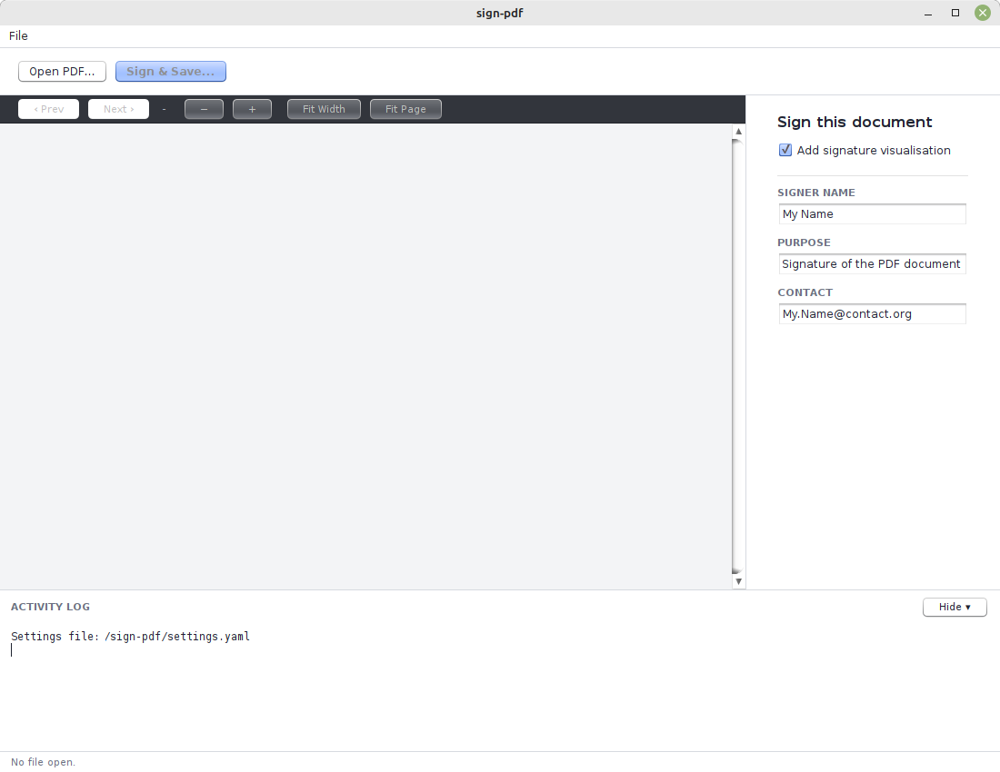
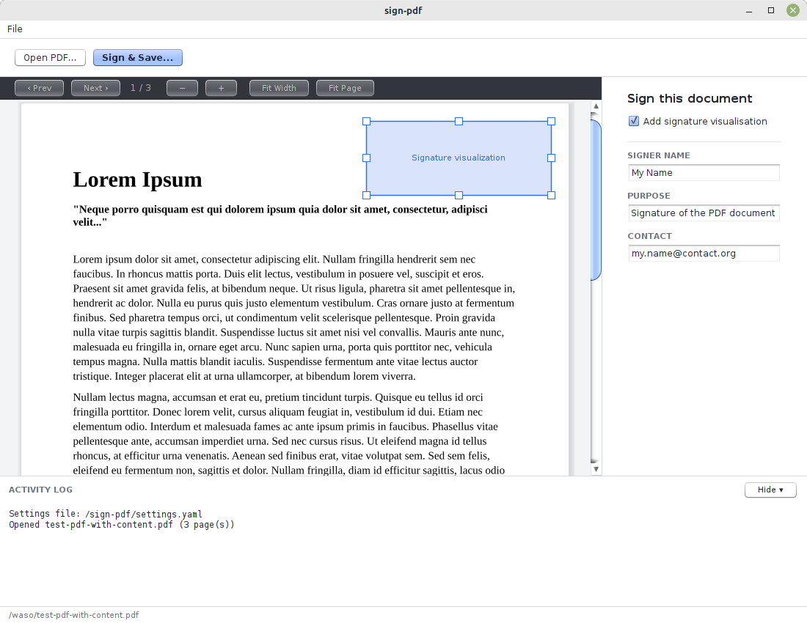
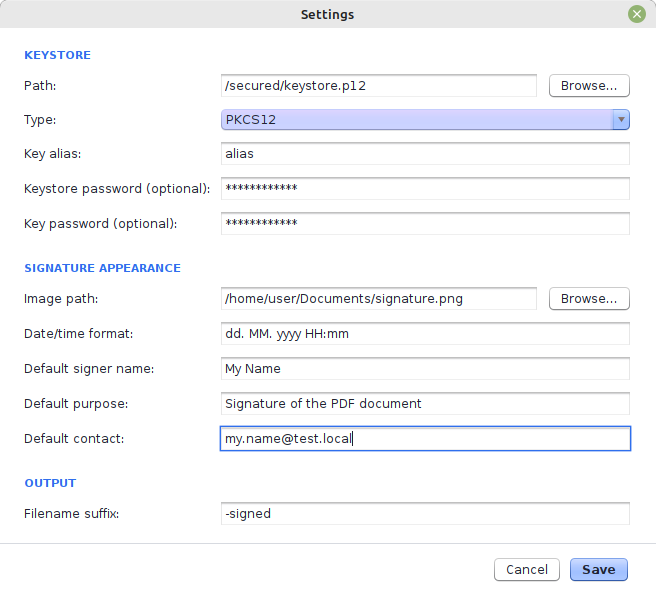

# sign-pdf

The sign-pdf is A small Java tool for applying a **visible PAdES (PDF Advanced Electronic Signature)** to a PDF file.
It signs with a key from a PKCS12/JKS keystore, stamps a signature image plus a text block (signer
name, date, certificate issuer/serial) at a chosen spot on the page, and then checks the result: the
embedded signature is validated cryptographically, and the file's PDF/A structure is checked.

It has a small Swing desktop UI for picking the PDF, the page, and where the visible signature goes —
and a CLI entry point for scripted use.

## Screenshots

**Main window** — open a PDF, page through it, fill in signer details:



**Placing a signature** — drag a rectangle on the page to mark where the visible signature goes:



**Settings** — keystore, signature image, and default signer details, saved to `settings.yaml`:




## Running

Launcher scripts are in [`etc/`](etc): [`sign-pdf.sh`](etc/sign-pdf.sh) for Linux/macOS and
[`sign-pdf.bat`](etc/sign-pdf.bat) for Windows. Both find the jar automatically — next to the script
first (drop the jar in `etc/` for a standalone deployment), otherwise `../target/` (a plain `mvn
package` checkout) — and launch the UI when run with no arguments, or the CLI when run with arguments:

```bash
# UI
etc/sign-pdf.sh
# CLI
etc/sign-pdf.sh input.pdf signed.pdf "Jane Doe" "Approval" "jane.doe@example.org" 1 50 700 200 80
```

```bat
:: UI
etc\sign-pdf.bat
:: CLI
etc\sign-pdf.bat input.pdf signed.pdf "Jane Doe" "Approval" "jane.doe@example.org" 1 50 700 200 80
```

Or run the jar directly with `java`, as shown below.

## Using the UI

```bash
java -jar target/sign-pdf-1.0-jar-with-dependencies.jar
```

1. **File → Settings...** — set the keystore path, type (PKCS12/JKS), key alias, and the signature
   image to stamp onto the page. Keystore/key passwords are optional here: leave them blank and you'll
   be prompted for them when you sign instead of storing them on disk. Settings are saved to
   `settings.yaml`; see [where `settings.yaml` lives](#where-settingsyaml-lives) for exactly where.
2. **File → Open PDF...** — pick the file to sign. Use the `< Prev` / `Next >` buttons to get to the
   right page.
3. Either **drag a rectangle** on the page to mark where the new visible signature goes, or, if the PDF
   already has an empty signature field on it, pick it from the **Signature placement** dropdown
   instead of drawing a new one.
4. Fill in **Signer name** (required), **Purpose**, and **Contact** — these default to whatever you set
   in Settings.
5. **Sign & Save...** — pick where to write the signed copy. The tool signs, then reports the
   signature's cryptographic validity and the PDF/A structural check in the log panel at the bottom.

## Using the CLI

```bash
java -cp target/sign-pdf-1.0-jar-with-dependencies.jar org.r7c.pdf.pades.PadesUtils \
  input.pdf signed.pdf "Jane Doe" "Approval" "jane.doe@example.org" 1 50 700 200 80
```

```bash
java -cp target/sign-pdf-1.0-jar-with-dependencies.jar org.r7c.pdf.pades.PadesUtils \
  -s /path/to/settings/dir \
  input.pdf signed.pdf "Jane Doe" "Approval" "jane.doe@example.org" 1 50 700 200 80
```

Arguments: `[-s <settingsDir>] <fileToBeSigned> <fileSigned> signerName purpose contact page x y width
height` (page is 1-based; x/y/width/height are in PDF points, origin bottom-left). `-s` is optional and
CLI-only — see below for where the CLI looks for `settings.yaml` when it's omitted.

Keystore and signature-image settings come from the same `settings.yaml` the UI uses; see
[where `settings.yaml` lives](#where-settingsyaml-lives). If it leaves the keystore/key password blank,
set the `KEYSTORE_PASSWORD` / `KEY_PASSWORD` environment variables before running — the CLI has no
interactive prompt.

## `settings.yaml`

```yaml
keystore:
  path: /home/user/secured/company-signing.p12
  type: PKCS12
  keyAlias: company-key
  password: ""       # optional; leave blank to be prompted in the UI at sign time
  keyPassword: ""     # optional; same as above
signature:
  imagePath: /home/user/signatures/signature.png
  dateTimeFormat: "dd. MM. yyyy HH:mm"
  textTemplate: "Signer: ${NAME}\nDatum: ${DATETIME}\nCert. Izd.: ${ISSUER}\nSer. st.: ${SERIAL}"
  defaultSignerName: ""
  defaultPurpose: ""
  defaultContact: ""
output:
  suffix: "-signed"
```

`textTemplate` is the text stamped next to the signature image; it supports the named placeholders
`${NAME}`, `${DATETIME}`, `${ISSUER}`, `${SERIAL}` (signer name, formatted signing date, certificate
issuer, certificate serial number). Any placeholder you leave out of the template is simply not
written — e.g. `"Signer: ${NAME}\nDate: ${DATETIME}"` stamps only those two lines. A blank/missing
`textTemplate` falls back to the default shown above. Use a double-quoted YAML string so `\n` is
interpreted as a line break.

### Where `settings.yaml` lives

The UI and the CLI share one `settings.yaml`, but its directory isn't fixed — it's resolved through a
search path so you can keep it outside the install folder (a per-user config, a shared install
directory, a test fixture, etc.) instead of having to drop it next to the jar.

**Loading** checks these locations in order and uses the first one that actually has a
`settings.yaml`:

1. The `spdf.settings` system property (a directory), e.g. `-Dspdf.settings=/path/to/dir`
2. The CLI's `-s <dir>` flag (CLI only — the Swing UI has no command-line arguments to read)
3. `~/.warp/sign-pdf/`
4. The current working directory
5. The folder containing the running jar (the original, and still the last resort, behavior)

If none of them have a `settings.yaml` yet, the app starts with built-in defaults (empty keystore
path, `-signed` output suffix, etc.) — nothing on disk is required to launch.

**Saving** (Settings dialog in the UI) writes back to wherever the file was actually loaded from. The
first time it's saved without an existing file anywhere above, the target directory is chosen by a
separate priority:

1. `spdf.settings`, if set — written there directly, no fallback
2. `~/.warp/sign-pdf/` — created automatically if it doesn't exist
3. The current working directory, if the user-folder above couldn't be created (e.g. no permission to
   create it)
4. The folder containing the running jar, as the final fallback

Once a location is picked for a given run (whether by finding an existing file or by choosing a save
target), that same file is reused for every subsequent load/save in that run — it won't jump between
candidates mid-session.

Examples:

```bash
# UI: read/write settings.yaml from a specific directory
java -Dspdf.settings=/opt/sign-pdf-config -jar target/sign-pdf-1.0-jar-with-dependencies.jar

# CLI: same, via -s instead of the system property
java -cp target/sign-pdf-1.0-jar-with-dependencies.jar org.r7c.pdf.pades.PadesUtils \
  -s /opt/sign-pdf-config input.pdf signed.pdf "Jane Doe" "Approval" "jane.doe@example.org" 1 50 700 200 80
```

## Build

### Requirements

- Java 21
- Maven (`mvn`) — there's no wrapper checked in
- Network access for the first build (dependencies resolve from Maven Central)


```bash
mvn package
```

This produces two jars in `target/`:

- `sign-pdf-1.0.jar` — plain jar, for use on a classpath you assemble yourself
- `sign-pdf-1.0-jar-with-dependencies.jar` — runnable standalone, this is the one you want


